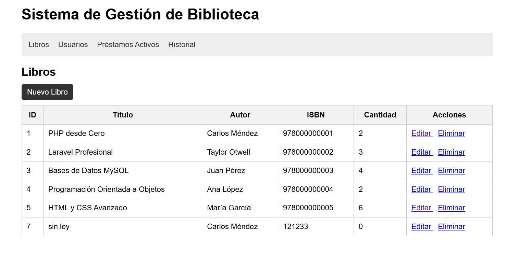
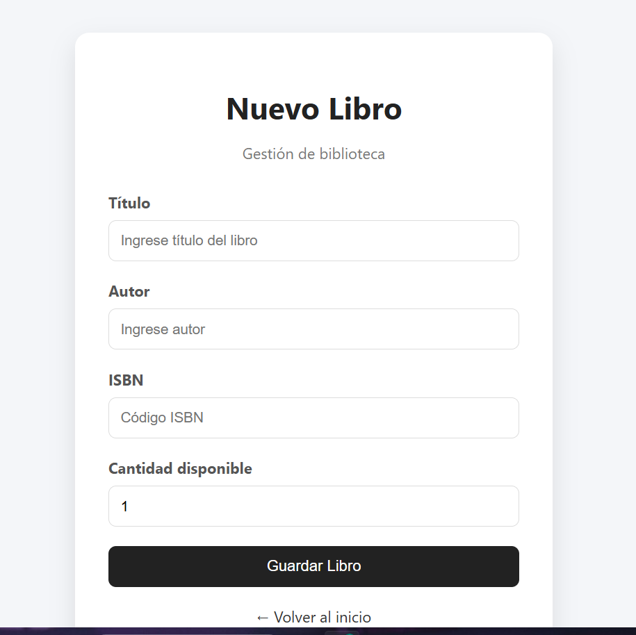
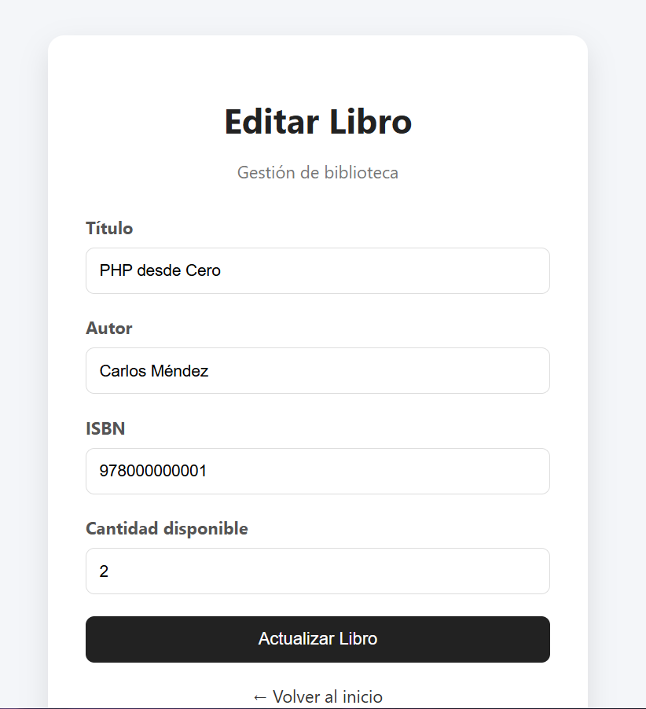
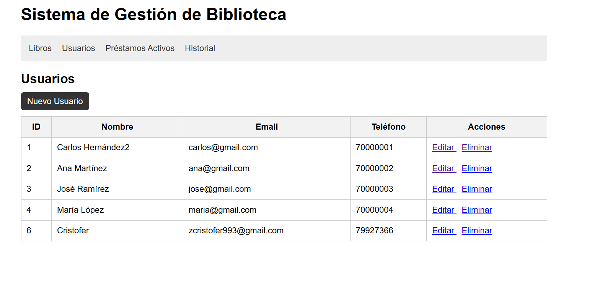
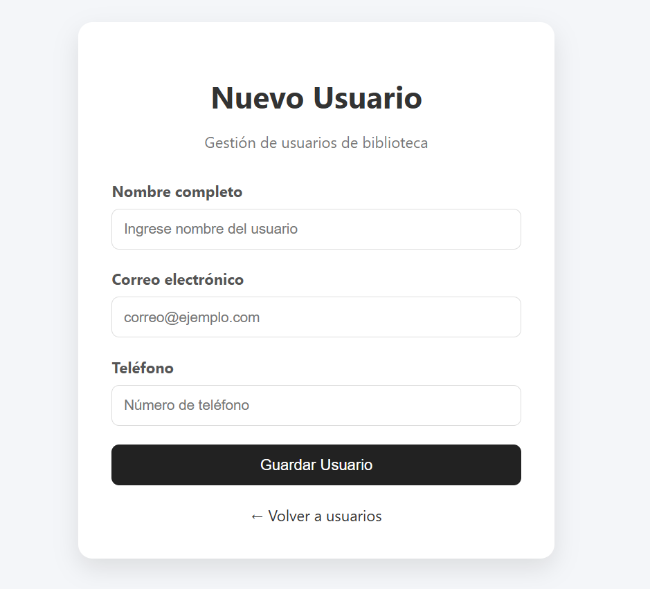
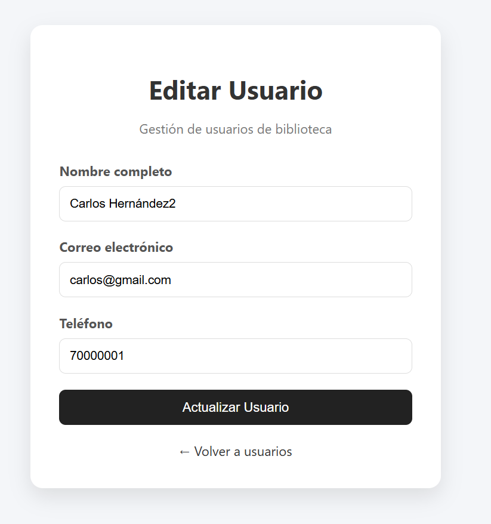
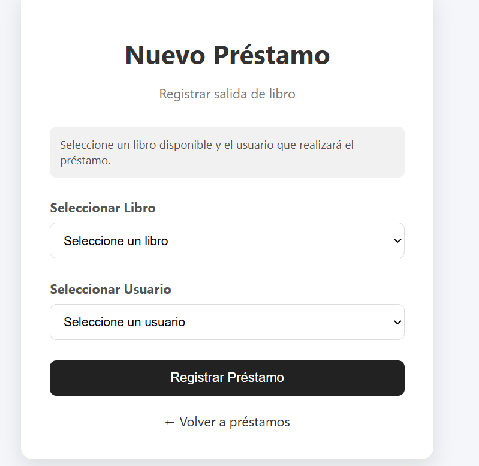
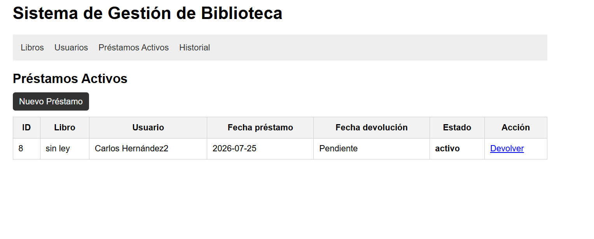
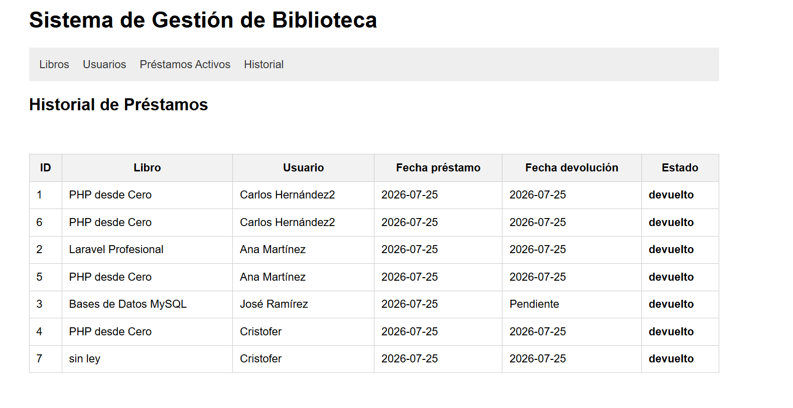

# Sistema de Gestión de Biblioteca

## Descripción

Sistema de gestión de biblioteca desarrollado en PHP utilizando Programación Orientada a Objetos (OOP).

La aplicación permite administrar libros, usuarios y préstamos mediante operaciones CRUD, además de controlar automáticamente la disponibilidad de los libros al realizar préstamos y devoluciones.

El proyecto fue desarrollado como una mini aplicación web utilizando PHP, MySQL y PDO.

## Tecnologías utilizadas

- PHP 8+
- MySQL
- PDO para conexión a base de datos
- HTML5
- CSS3
- XAMPP

## Estructura del proyecto

C:\
└── xampp\
    └── htdocs\
        └── library-management-system\
            │
            ├── classes\
            │   ├── Biblioteca.php
            │   ├── Database.php
            │   ├── Libro.php
            │   ├── Prestamo.php
            │   └── Usuario.php
            │
            ├── views\
            │   ├── libros\
            │   │   └── formulario.php
            │   │
            │   ├── usuarios\
            │   │   └── formulario.php
            │   │
            │   └── prestamos\
            │       └── formulario.php
            │
            ├── screenshots\
            │   ├── crearLibro.png
            │   ├── crearPrestamo.png
            │   ├── crearUsuario.png
            │   ├── editarLibro.png
            │   ├── editarUsuario.png
            │   ├── historial-prestamos.png
            │   ├── libros.png
            │   ├── prestamosActivos.png
            │   └── usuarios.png
            │
            ├── biblioteca.sql
            ├── index.php
            ├── README.md
            └── .gitignore

## Instalación y configuración

### Requisitos

- PHP 8 o superior
- MySQL
- XAMPP, Laragon o cualquier servidor local
- Navegador web

### Clonar el repositorio

git clone https://github.com/criszaval/library-management-system.git

### Colocar el proyecto en el servidor

Si utilizas XAMPP, copia la carpeta del proyecto dentro de:

C:\xampp\htdocs\

Debe quedar así:

C:\xampp\htdocs\library-management-system\

### Crear la base de datos

Abre phpMyAdmin e importa el archivo:

biblioteca.sql

Este archivo crea automáticamente:

- Base de datos `biblioteca`
- Tabla `libros`
- Tabla `usuarios`
- Tabla `prestamos`

### Configurar la conexión

Edita el archivo:

classes/Database.php

Verifica las credenciales:

private $host = "localhost";
private $db = "biblioteca";
private $user = "root";
private $password = "";

### Ejecutar el proyecto

Abre en el navegador:

http://localhost/library-management-system/

## Funcionalidades

### Gestión de libros

- Registrar libros.
- Editar libros.
- Eliminar libros.
- Consultar libros.
- Controlar la cantidad disponible.

### Gestión de usuarios

- Registrar usuarios.
- Editar usuarios.
- Eliminar usuarios.
- Consultar usuarios registrados.

### Gestión de préstamos

- Registrar préstamos.
- Asociar libros con usuarios.
- Disminuir automáticamente la cantidad disponible del libro.
- Registrar devoluciones.
- Actualizar nuevamente la cantidad disponible.

### Historial de préstamos

Permite consultar:

- Libros prestados.
- Usuarios asociados.
- Fecha del préstamo.
- Fecha de devolución.
- Estado del préstamo.

Estados disponibles:

- Activo
- Devuelto

## Arquitectura

El sistema está desarrollado utilizando Programación Orientada a Objetos (OOP).

### Modelos

- Libro
- Usuario
- Prestamo

### Clase Biblioteca

La clase `Biblioteca` centraliza la lógica del sistema:

- Operaciones CRUD.
- Gestión de préstamos.
- Actualización del inventario.
- Consultas a la base de datos.

### Base de datos

La comunicación con MySQL se realiza mediante:

- PDO.
- Consultas preparadas.
- Parámetros enlazados (Bind Parameters).

## Capturas del sistema

### Vista principal de libros

### Registrar libro

### Editar libro

### Vista de usuarios

### Registrar usuario

### Editar usuario

### Registrar préstamo

### Préstamos activos

### Historial de préstamos

## Autor

Cristofer Zavala

Proyecto académico desarrollado como práctica de Programación Orientada a Objetos utilizando PHP, MySQL y PDO.

## Licencia

Este proyecto fue desarrollado con fines educativos.
